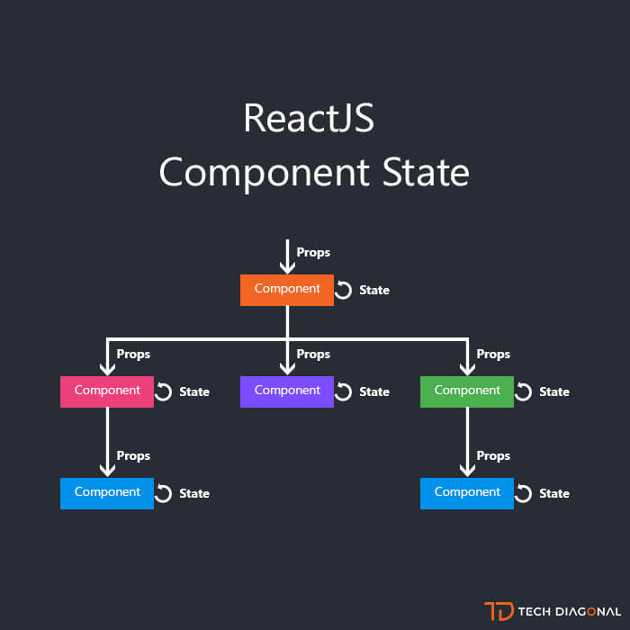

# #0 What is React Component?



## 1-1 React Component

리액트로 만들어진 앱을 이루는 최소한의 단위가 컴포넌트이다. 사용자가 보게되는 뷰는 이 컴포넌트들의 조합으로 만들어진다. 기능을 단위별로 캡슐화하는 리액트의 기본단위.

작고, 재사용이 가능한 코드 덩어리

Input으로 props 를 받고 화면에 element를 반환한다.

Class형 컴포넌트와 Function형 컴포넌트가 있다.

최근엔 Function형 컴포넌트 & Hook 을 많이 사용한다.

컴포넌트 이름은 항상 대문자로 시작한다.

```
// Function Component 예제 

Function Welcome(props) {
Return <h1>Hello,  {props.name}</h1>;
}
```

```
// Class Componrnt 예제

Class Welcome extnds React.Component {
	Render() {
	Return <h1>Hello, (this.props.name)</h1>;
}
}
```
## 1-2  Composing Component

컴포넌트는 자신의 출력에 다른 컴포넌트를 참조할 수 있다.

```
// 컴포넌트 합성 예제 

Function Welcome(props) {
	Return <h1>Hello, {props.name}</h1>
}

Function App() {
return(

	<div>	
		<Welcome name=”Seung” />
		<Welcome name=”Kim />
        <Welcome name=”Park” />
    </div>

);
}

ReactDOM.render(
<App />,
Document.getElementById(‘root’)
);
```


## 1-3 Extracting Component
```
// 컴포넌트 추출 예제


function Comment(props) {
  return (
    <div className="Comment">
      <div className="UserInfo">
        
        <div className="UserInfo-name">
          {props.author.name}
        </div>
      </div>
      <div className="Comment-text">
        {props.text}
      </div>
      <div className="Comment-date">
        {formatDate(props.date)}
      </div>
    </div>
  );
}

// 위의 컴포넌트를 아래와 같이 추출하여 보다 간결하게 컴포넌트 생성

function Avatar(props) {
  return (
      );
}

function UserInfo(props) {
  return (
    <div className="UserInfo">      <Avatar user={props.user} />      <div className="UserInfo-name">        {props.user.name}      </div>    </div>  );
}

function Comment(props) {
  return (
    <div className="Comment">
      <UserInfo user={props.author} />      <div className="Comment-text">
        {props.text}
      </div>
      <div className="Comment-date">
        {formatDate(props.date)}
      </div>
    </div>
  );
}
```

---

# #1 Component Rendering Example

```

Component Rendering 예제

function Welcome(props) {
	return <h1>Hello, {props.name}</h1>;
}

const element = <Welcome name=”Seung” />;
ReactDOM.render(Element, document.getElementById(‘root’)); 

```

---


# #2 What is props & state ?


Props 부모 컴포넌트가 자식 컴포넌트에게 주는 데이터, 직접 수정이 불가능하다.

State 컴포넌트 내부에 가지고 있는 값, 내부에서 변경이 가능하다.

---

# #3 What is LifeCycle Method ?


생명주기 메서드는 컴포넌트가 브라우저 상에 나타나고, 업데이트 되고 사라지게 될 떄 호출되는 메서드들이다. 클래스형 컴포넌트에서만 사용 할 수 있다.

**React LifeCycle => Mount – Update – Unmount**

## 1-1	마운트 될 때 발생하는 생명주기들

1) constructor : 컴포넌트의 생성자 메서드. 컴포넌트가 만들어지면 가장 먼저 실행되는 메서드이다.  

2) getDerivedStateFromProps : props 로 받아온 것을 state 에 넣어주고 싶을 때 사용하는 메서드.  

3) render : 컴포넌트를 렌더링하는 메서드  

4) componentDidMount : 컴포넌트의 첫번째 렌더링 끝나면 호출되는 메서드. 이 메서드가 호출되는 시점에는 우리가 만든 컴포넌트가 화면에 나타난 상태이다. 여기선 주로 외부 라이브러리 연동 및 컴포넌트에서 필요로하는 데이터 요청위해. Axios, fetch 등을 통하여 ajax 요청, DOM의 속성 읽기 및 변경하는 작업을 진행한다.  

## 1-2	컴포넌트가 업데이트 되는 시점에 호출되는 생명주기 메서드들

1) getDerivedStateFromprops : 컴포넌트의 props 나 state 가 바뀌었을때도 이 메서드가 호출된다.

2) shouldComponentUpdate : 컴포넌트가 리렌더링 할지 말지를 결정하는 메서드이다. 주로 최적화 시 사용되는 메서드이다.

3) render 

4) getSnapeshotBeforeUpdate : 컴포넌트에 변화가 일어나기 직전의 DOM 상태를 가져와서 사용 할 수 있게 해주는 메서드. 

5) componentDidUpdate : 리렌더링이 끝나고 화면에 우리가 원하는 변화가 모두 반영되고 난 뒤 호출되는 메서드이다. 3번째 파라미터로 getSnapshotBeforeUpdate 에서 반환한 값을 조회 할 수 있다.

## 1-3 언마운트 시 호출되는 생명주기 메서드

1) componentWillUnmount : 컴포넌트가 화면에서 사라지기 직전에 호출되는 메서드.

---

***추후 내용 수정 및 보충 예정 // 2021.07.14***